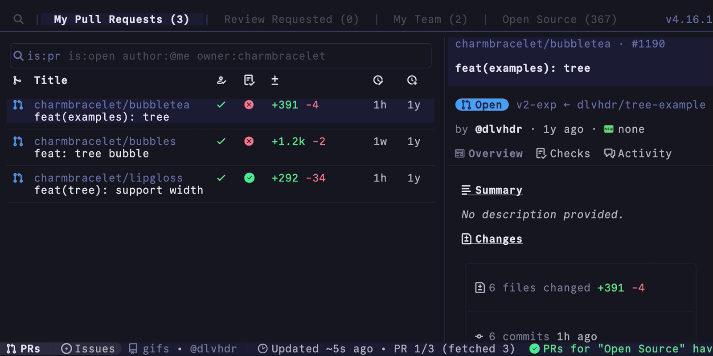
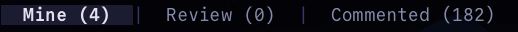
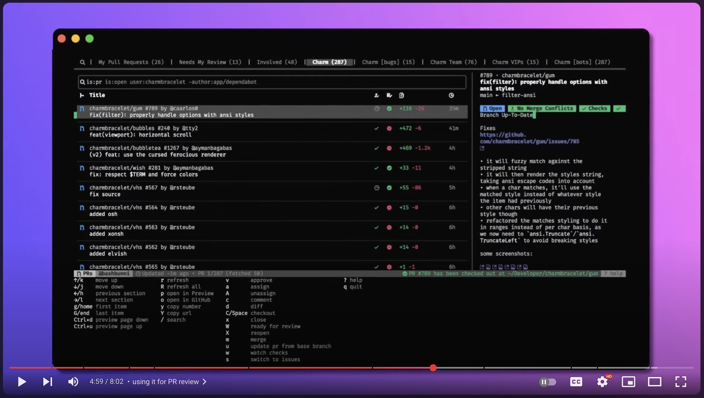
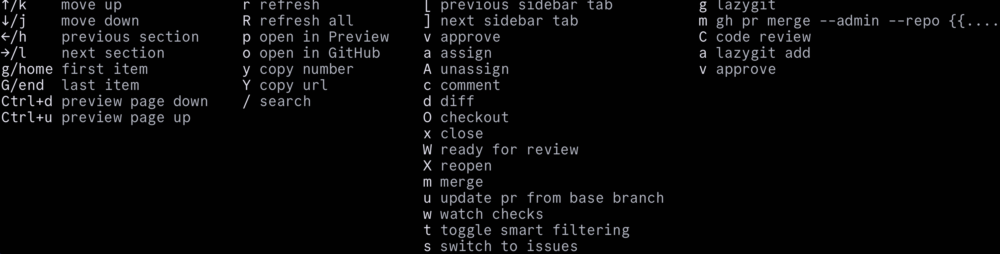
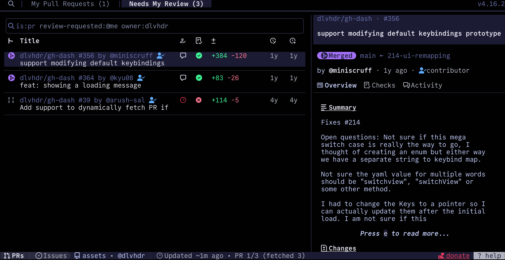
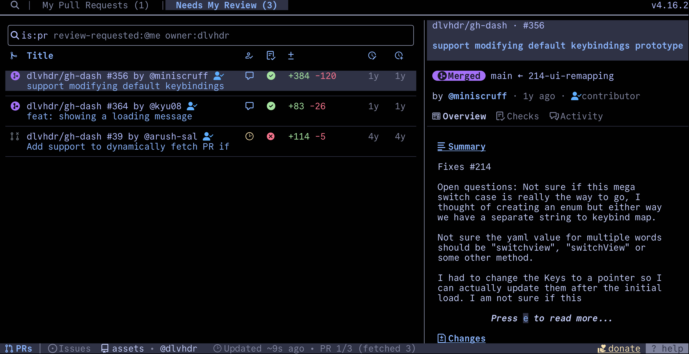

<div align="center">

# ⚡ gh-dash

### Terminal dashboard tối giản, nhanh và đẹp cho GitHub CLI

<p>
  <a href="https://github.com/dlvhdr/gh-dash/actions"></a>
  <a href="https://github.com/dlvhdr/gh-dash/releases"></a>
  <a href="LICENSE.txt"></a>
  <a href="https://github.com/dlvhdr/gh-dash/stargazers"></a>
</p>

> Quản lý Pull Request, Issue, Notification và Workflow ngay trong terminal — tập trung, gọn gàng và dùng hoàn toàn bằng bàn phím.



</div>

---

## ✨ Thiết kế giao diện dòng lệnh

<div align="center">
  
</div>

<br>

<div>
  <p><strong>⚡ Điều hướng nhanh:</strong> tối ưu cho bàn phím với các phím quen thuộc như <code>j</code>, <code>k</code>, <code>/</code>, <code>Enter</code>.</p>
  <p><strong>🧭 Bố cục rõ ràng:</strong> top bar để chuyển section, vùng tìm kiếm lớn, danh sách PR/Issue bên trái và preview chi tiết bên phải.</p>
  <p><strong>🎨 Theme terminal:</strong> hỗ trợ nhiều phong cách màu tối, tương phản cao, phù hợp màn hình desktop lẫn laptop nhỏ.</p>
  <p><strong>🧩 GitHub-native:</strong> cài như extension của <code>gh</code>, dùng trực tiếp trong workflow review hằng ngày.</p>
</div>

---

## 📱 Bố cục mobile-friendly trong README

Thay vì nhồi quá nhiều bảng rộng, README được chia thành các khối ngắn để dễ đọc trên điện thoại:

- **Hero + ảnh giới thiệu** ở đầu trang để người dùng thấy ngay sản phẩm.
- **Quick actions** bằng code block ngắn, dễ copy trên mobile.
- **Ảnh demo theo từng ngữ cảnh**: tổng quan, theme, help screen và workflow.
- **Bảng phím tắt tối giản** chỉ giữ những thao tác quan trọng nhất.

<div align="center">
  
</div>

---

## 📚 Mục lục

- [Cài đặt nhanh](#-cài-đặt-nhanh)
- [Bộ sưu tập hình ảnh](#-bộ-sưu-tập-hình-ảnh)
- [Luồng sử dụng trong terminal](#-luồng-sử-dụng-trong-terminal)
- [Phím tắt mặc định](#-phím-tắt-mặc-định)
- [Cấu hình mẫu](#-cấu-hình-mẫu)
- [Tùy biến thường dùng](#-tùy-biến-thường-dùng)
- [Dành cho nhà phát triển](#-dành-cho-nhà-phát-triển)
- [Khắc phục sự cố](#-khắc-phục-sự-cố)
- [Đóng góp](#-đóng-góp)

---

## 🚀 Cài đặt nhanh

### 1. Cài qua GitHub CLI Extension

```bash
gh auth login
gh extension install dlvhdr/gh-dash
gh dash
```

### 2. Cài qua Homebrew

```bash
brew tap dlvhdr/gh-dash
brew install gh-dash
```

### 3. Cài bằng Go

```bash
go install github.com/dlvhdr/gh-dash@latest
```

> Yêu cầu khuyến nghị: đã cài `gh`, đã đăng nhập GitHub và terminal hỗ trợ UTF-8.

---

## 🖼️ Bộ sưu tập hình ảnh

<table>
  <tr>
    <td width="50%">
      
      <br><strong>Tổng quan PR review</strong>
    </td>
    <td width="50%">
      
      <br><strong>Help screen và phím tắt</strong>
    </td>
  </tr>
  <tr>
    <td width="50%">
      
      <br><strong>Theme Tokyo Night</strong>
    </td>
    <td width="50%">
      
      <br><strong>Theme Catppuccin</strong>
    </td>
  </tr>
</table>

> Trên màn hình nhỏ, GitHub tự xếp lại ảnh theo chiều dọc nên phần giới thiệu vẫn dễ xem trên mobile.

---

## 🧭 Luồng sử dụng trong terminal

```text
┌─ Top navigation ───────────────────────────────────────────────┐
│ 🔍 | My Pull Requests | Needs My Review | Issues | v4.16.x     │
├─ Search / filter ──────────────────────────────────────────────┤
│ is:pr is:open author:@me owner:dlvhdr                         │
├─ List view ────────────────────────┬─ Preview panel ───────────┤
│ #356 support keybindings prototype │ Merged · main ← branch     │
│ #364 feat: loading message         │ Overview · Checks · Diff   │
│ #039 dynamically fetch PR          │ Summary and comments       │
├─ Status bar ───────────────────────────────────────────────────┤
│ PRs · Issues · assets · updated ~1m ago · ? help               │
└────────────────────────────────────────────────────────────────┘
```

1. Chọn section ở thanh trên cùng.
2. Lọc nhanh bằng GitHub search query.
3. Di chuyển trong danh sách PR/Issue bằng bàn phím.
4. Xem preview, diff, checks và mở GitHub khi cần.

---

## ⌨️ Phím tắt mặc định

| Phím | Hành động | Ghi chú |
| --- | --- | --- |
| `j` / `k` | Di chuyển xuống / lên | Điều hướng theo từng dòng. |
| `h` / `l` | Chuyển section | Qua lại giữa PR, Issue, Notification. |
| `Enter` | Mở chi tiết | Xem preview hoặc mở item được chọn. |
| `o` | Mở trên trình duyệt | Mở PR/Issue trong GitHub web. |
| `c` | Checkout branch | Checkout nhánh PR về local. |
| `d` | Xem diff | Mở thay đổi của PR. |
| `/` | Tìm kiếm và lọc | Lọc nhanh trong section hiện tại. |
| `r` | Làm mới dữ liệu | Gọi lại GitHub API. |
| `?` | Mở trợ giúp | Hiển thị danh sách phím tắt. |
| `q` | Thoát | Đóng dashboard. |

---

## ⚙️ Cấu hình mẫu

File cấu hình mặc định nằm tại `~/.config/gh-dash/config.yml`.

```yaml
# ~/.config/gh-dash/config.yml
theme:
  ui:
    colors:
      primary: "#7C3AED"
      secondary: "#3B82F6"
      accent: "#10B981"
      background: "#0F172A"
      text: "#F8FAFC"
  borderStyle: "rounded"

defaults:
  previewWidth: 60
  refreshInterval: 30
  language: "vi"

prSections:
  - title: "My Open PRs"
    filters: "is:open author:@me"
  - title: "Needs My Review"
    filters: "is:open review-requested:@me"

issueSections:
  - title: "Assigned to Me"
    filters: "is:open assignee:@me"
```

---

## 🎨 Tùy biến thường dùng

| Tham số | Kiểu | Giá trị mẫu | Công dụng |
| --- | --- | --- | --- |
| `theme.ui.colors.primary` | `string` | `#7C3AED` | Màu nhấn cho item đang active. |
| `theme.borderStyle` | `string` | `rounded` | Kiểu border: `rounded`, `double`, `normal`, `none`. |
| `defaults.previewWidth` | `number` | `60` | Độ rộng vùng preview. |
| `defaults.refreshInterval` | `number` | `30` | Chu kỳ refresh theo giây. |
| `prSections[].filters` | `string` | `is:open author:@me` | GitHub search query cho PR section. |
| `issueSections[].filters` | `string` | `is:open assignee:@me` | GitHub search query cho Issue section. |

---

## 🧑‍💻 Dành cho nhà phát triển

```bash
# Clone repository
git clone https://github.com/dlvhdr/gh-dash.git
cd gh-dash

# Chạy test Go
go test ./...

# Chạy ứng dụng local
go run .
```

Nếu bạn làm việc với giao diện tài liệu trong repo này:

```bash
npm install
npm run dev
npm run build
```

---

## 🧯 Khắc phục sự cố

| Vấn đề | Nguyên nhân thường gặp | Cách xử lý |
| --- | --- | --- |
| `gh CLI not authenticated` | Chưa đăng nhập GitHub CLI. | Chạy `gh auth login`. |
| `Rate limit exceeded` | Hết quota GitHub API. | Kiểm tra token hoặc giảm tần suất refresh. |
| Giao diện bị lệch | Terminal chưa bật UTF-8 hoặc font không hỗ trợ ký tự box drawing. | Đặt `LANG=en_US.UTF-8` và dùng Nerd Font/monospace. |
| Không thấy PR/Issue | Filter quá chặt hoặc sai repository context. | Kiểm tra lại `filters` trong `config.yml`. |

---

## 🤝 Đóng góp

Mọi đóng góp đều được chào đón:

1. Fork repository và tạo branch mới từ `main`.
2. Chạy `go test ./...` trước khi gửi thay đổi.
3. Format code bằng `gofmt -s -w .` nếu có chỉnh Go.
4. Mở Pull Request với mô tả rõ ràng và liên kết issue liên quan nếu có.

<div align="center">

**Made for developers who live in the terminal.**

</div>
